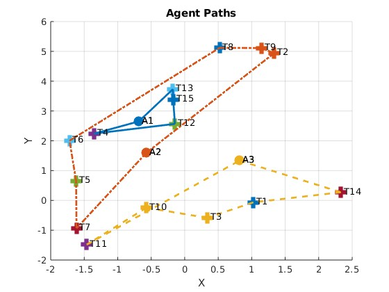

# GA_MRTA
This is the source code of the Centralized Genetic Algorithm (GA) applied for ST-SR-TA 
(Single task per robots - single robot per tasks - time extended) Multi Robot Task Allocation (MRTA) problem.

To run the program, dowload all the source code and run "main.m" in MATLAB

